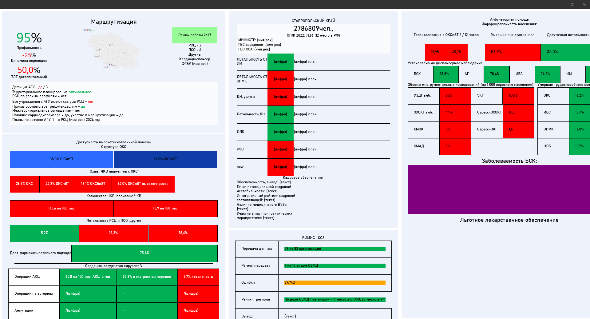

# Region Healthcare Monitoring
# Описание проекта
Region Healthcare Monitoring - это приложение для мониторинга состояния здравоохранения в регионах. Приложение позволяет просматривать данные по медицинским учреждениям, вакансиям в медицинских учреждениях, расходам на здравоохранение, а также статистику заболеваемости в различных регионах.
!Проект находится в процессе разработки!

## Используемые технологии
- MAUI
- .NET 6
- C#
- XAML

# Функциональность приложения

Просмотр информации о медицинских учреждениях в разных регионах.
Просмотр расходов на здравоохранение в различных регионах.
Просмотр статистики заболеваемости в различных регионах.
Анализ данных и формирование отчетов.

# Скриншоты приложения
Вид программы на раннемм этапе разработки:


# Установка и использование
Для установки приложения необходимо:

Склонировать репозиторий:
```bash
git clone https://github.com/BogaRU/RegionHealthcareMonitoring.git
```
Открыть и собрать проект в Visual Studio.
